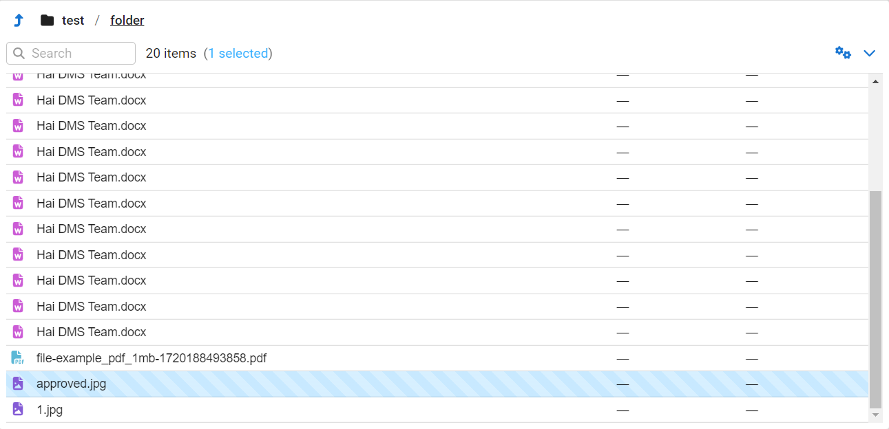

<div align="center">

# React File Explorer

</div>

<p align="center">
    
</p>

> A file explorer component for React. It tries to recreate the native file
> browsing experience in your browser. This means your users can make selections, drag
> & drop files, toggle between _List_ and _Grid_ file views, use keyboard shortcuts, and
> much more!

### Installation

Install it using your favourite package manager.

```sh
npm install @codetez/react-file-explorer
```

```sh
yarn add @codetez/react-file-explorer
```

```sh
pnpm add @codetez/react-file-explorer
```

```sh
bun add @codetez/react-file-explorer
```

### Usage

```typescript
import  {
  FileBrowser,
  FileNavbar,
  FileToolbar,
  FileList,
  FileContextMenu,
  IconFA
} from '@codetez/react-file-explorer'

export function MyComponent() {
    return (
      <FileBrowser iconComponent={IconFA} files={files}>
          <FileNavbar />
          <FileToolbar />
          <FileList />
          <FileContextMenu />
      </FileBrowser>
    );
}
```

### Documentation

WIP.

## Developing

Install dependencies:

```
pnpm install
```

Build:

```
pnpm run build
```

## License

MIT © CodeTez Technologies Private Limited. 2024

MIT © Aperture Robotics, LLC. 2023

MIT © [Tim Kuzhagaliyev](https://github.com/TimboKZ) 2020
